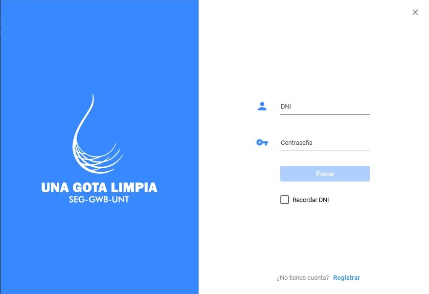
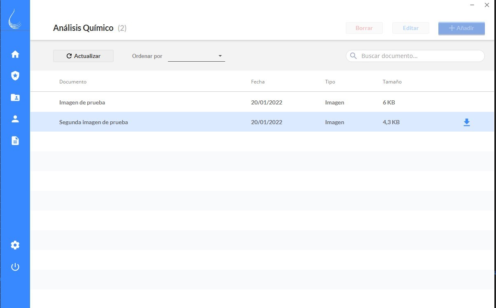

# SEG-UNT A clean drop JavaFx Client

### Project status
Currently in development

## Overview

Java / Spring Boot client application which provides a graphical user interface (GUI) to consume [restful services](https://github.com/llanillo/SEG-UNT-Rest-Services), ideal to improve the workflow of the project, keep the connections between the commissions and preserve all the information centralized.

Users can access the distinct commission’s document’s, only as watchers, keeping the order and classification of the information. Additionally, users could upload and edit documents to the commissions they belong to and check their own personal information inside the application. They will also have the option to see all the document’s uploaded by themselves, without the need to search for them in the commission tables, since some users belong to more than one.

SEG-UNT chapter will be able to see all users' information this way; it will be easier when carrying out procedures relevant to field trips.

Each commission/area/team will have its own section with a table where all the files belonging to this will be displayed. As a control measure for the addition, editing and deletion of files, each of these actions will first go to the "Managers" section, who will be in charge of approving, requesting editing or discarding said action. It should be noted that there will be more than one person in charge per commission and they will only be able to carry out these actions with files from their assigned area.

There is also the role of "Administrator", they will have the same functionality as “Manager” but without the restriction of assigned commission, they will also be able to assign managers; accept, modify or delete both users and files. 

Also, they have access to the complete record of activities carried out in the application and the function of creating short news, which will be displayed in the initial window after logged in.

## Technologies

* Spring MVC
* JavaFX
* [JFoenix](http://www.jfoenix.com/)
* Maven
* [Lombok](https://github.com/projectlombok/lombok)


## Environment Setup

Currently there is a [conflict between JDK and JFoenix](https://github.com/sshahine/JFoenix/issues/955), you must add these VM Options to fix it temporally:
* "--add-opens java.base/java.lang.reflect=ALL-UNNAMED"
* "--add-opens java.base/java.lang.reflect=com.jfoenix"

Please make sure following software is installed to be able to execute any Spring or Maven command and avoid any errors:

* Lombok plugin support
* Spring plugin support
* Maven plugin support


### To run the application

The project can be imported as a maven application to any supported IDE. If you have any problems with the dependencies, run the command:

```
mvn dependency:resolve
```

Use Maven to build: 
```
mvn clean install
```

Use Spring boot plugin: 
```bash
mvn clean spring-boot:run
```

## Advantages

Permanent connectivity of the project’s team without dependence on external programs or  websites.. The stored information will be organized and updated, ensuring the accuracy of the content and its correct distribution to the commissions, serving as a reference for possible future work and the establishment of the bases for a news network.

### To do list

* Add caching functionality
* Add version control
* File preview
 
## Screenshots
### SEG-UNT student chapter certificate

### Desktop application
#### Login View


#### Main View

